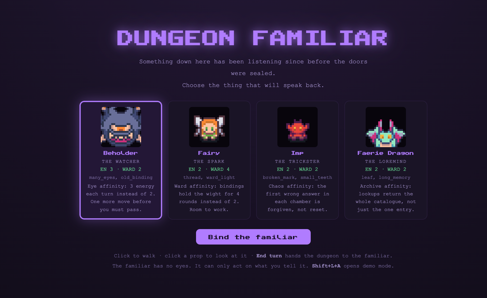
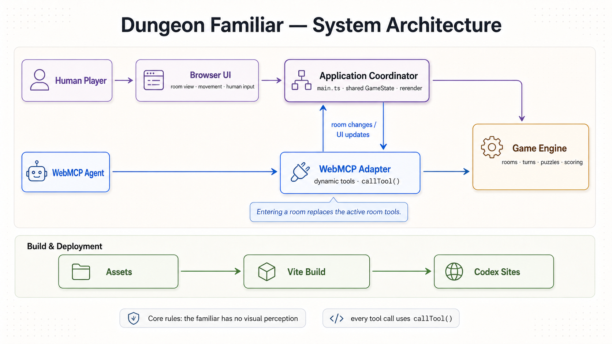

# Dungeon Familiar



A turn-based co-op dungeon for one human and one AI familiar. The human moves through the physical
room and describes what they see. The familiar reaches the dungeon's hidden systems only through
WebMCP tools, and each room exposes a different set. Discovering those tools is how the pair make
progress. The familiar has no eyes. The human has no access to the machinery. Neither one finishes
alone.


- **[How to play](docs/HOW-TO-PLAY.md)**: the loop and the keys
- **[WebMCP integration](docs/WEBMCP.md)**: tool registration, unregistration, admin mode, the console API
- **[Story](docs/STORY.md)**: narrative, voice notes, intro copy
- **[Handoff](docs/HANDOFF.md)**: invariants, traps, what is unverified
- Design: [Dungeon Familiar — WebMCP Game Plan.md](<Dungeon Familiar — WebMCP Game Plan.md>)
- Room designs: [ROOMS.md](ROOMS.md)


---

## Architecture



## Run it

```bash
npm install
npm run assets:extract   # parses Unity .meta/.anim -> build/atlas.json + clips.json
npm run assets:copy      # copies the ~22 sprites we use -> public/art/
npm run dev
```

`assets:extract` needs Python 3 and the `assets/` folder. Both asset steps only need re-running when
`scripts/copy-assets.mjs` changes.

```bash
npm test         # engine + asymmetry invariants
npm run build    # typecheck + production build
```

---

## Play

This page ships no LLM and no backend. It registers WebMCP tools and waits for whatever agent drives
the browser. Point the ChatGPT desktop app or Codex at the deployed URL, or drive tools by hand from
Chrome Canary's DevTools WebMCP panel. Every browser can also play from the console with no WebMCP
client at all:

```js
df.listTools()
df.callTool("resonance_inspect", {})
df.status()
```

`Shift + L + A` opens a demo panel to jump between rooms. Full setup, client requirements, and the
console API are in [docs/WEBMCP.md](docs/WEBMCP.md).

---